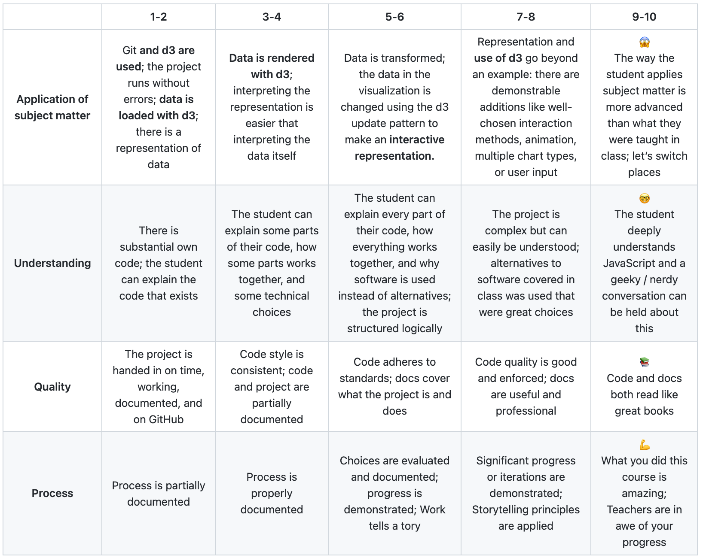

# :desktop_computer: Frontend data

## :bookmark_tabs:	 Table of Contents

* [Concept](https://github.com/lottekoblens/frontenddata#bulb-concept)
* [Proces](https://github.com/lottekoblens/frontenddata#chart_with_upwards_trend-proces)
* [Installation](https://github.com/lottekoblens/frontenddata/blob/master/README.md#wrench-installation)
* [Data](https://github.com/lottekoblens/frontenddata/blob/master/README.md#file_folder-data)
* [Wishlist](https://github.com/lottekoblens/frontenddata/blob/master/README.md#pencil-wishlist)
* [Assignment](https://github.com/lottekoblens/frontenddata/blob/master/README.md#clipboard-assignment)
  * [Rubric](https://github.com/lottekoblens/frontenddata/blob/master/README.md#page_facing_up-rubric)
* [Resources](https://github.com/lottekoblens/frontenddata/blob/master/README.md#mag_right-resources)
* [License](https://github.com/lottekoblens/frontenddata#license)

## :bulb: Concept


Display the data of the most popular songs of The Netherlands in a bar chart. The bar chart has a filter, so the duration of a song can be displayed and the amount of listeners. This data will also be shown when the mouse hovers over a bar.

## :chart_with_upwards_trend: Proces

If you want to know more about my proces. You can read my [Wiki](https://github.com/lottekoblens/frontenddata/wiki)!

## :wrench: Installation

If you want to use this code you have to clone the repository by putting this in your terminal: 

``` git clone https://github.com/lottekoblens/frontenddata ```

Then go to the folder barchart and you are ready to use the code.

## :file_folder:	 Data

The data I use, is fetched from the API Last.fm. I fetch the top numbers of The Netherlands. Then I use the name of the song, the duration of the song and the amount of listeners.


## :pencil: Wishlist

* Use issues better
* Using switch statements instead of if,else-statements

## :clipboard: Assignment

Create a data visualisation (using the d3 library) based on given data where data can be explored through interaction using enter(), update(), and exit().

### :page_facing_up: Rubric



## :mag_right: Resources

* Gratzl, S. (z.d.). D3 Tutorial. D3 Tutorial. Geraadpleegd op 9 november 2021, van https://www.sgratzl.com/d3tutorial/

## :page_with_curl: License

Author: Lotte Koblens, license by [MIT](https://github.com/lottekoblens/frontenddata/blob/master/LICENSE)
